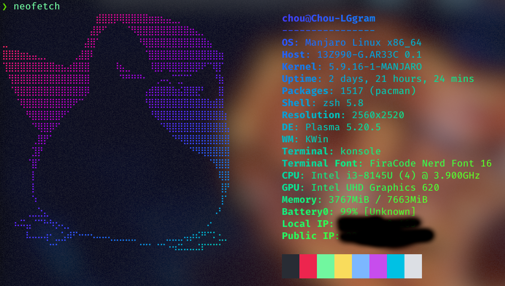
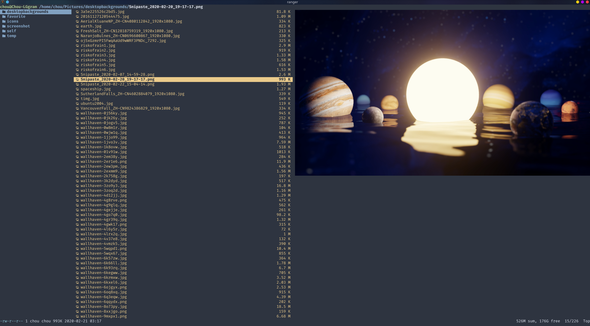

# Dotfiles

>   我的manjaro配置文件，本地使用[dotbare](https://github.com/kazhala/dotbare)管理，同时同步在[github](https://github.com/violencemofrog/dotfiles)上，以下是一些配置说明和软件清单

## [alacritty](https://github.com/violencemofrog/dotfiles/tree/main/.config/alacritty)

*   更多设置见[alacritty](https://github.com/alacritty/alacritty)
*   主题配色见[alacritty-theme](https://github.com/eendroroy/alacritty-theme)，图中为Nord

## [zsh](https://github.com/violencemofrog/dotfiles/blob/main/.zshrc)

*   使用[oh my zsh](https://github.com/ohmyzsh/ohmyzsh)
*   主题为[powerlevel10k](https://github.com/romkatv/powerlevel10k)

## [neofetch](https://github.com/violencemofrog/dotfiles/tree/main/.config/neofetch)

*   更多设置见[neofetch](https://github.com/dylanaraps/neofetch)
*   ascii字符画见[twitchquotes](https://www.twitchquotes.com/copypastas/ascii-art)

## [Vim](https://github.com/violencemofrog/dotfiles/blob/main/.vimrc)

*   插件管理器为[vim-plug](https://github.com/junegunn/vim-plug)

## [Vis](https://github.com/violencemofrog/dotfiles/tree/main/.config/vis)

*   插件，配置和主题详见[Vis](https://github.com/martanne/vis)

## Ranger

*   更多配置详见[ranger](https://github.com/ranger/ranger)
*   预览图像需要安装w3m，同时修改文件`rc.conf`中的`set preview_images False`为`set preview_images True`
*   ranger图标为项目[ranger_devicons](https://github.com/alexanderjeurissen/ranger_devicons)，需要安装Nerd Font如nerd-fonts-source-code-pro，同时修改终端自体为Nerd Font的版本