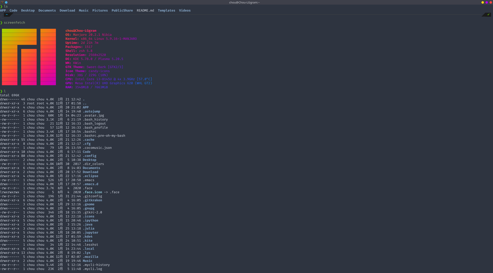

# Dotfiles

>   我的manjaro配置文件，本地使用[dotbare](https://github.com/kazhala/dotbare)管理，同时同步在[github](https://github.com/violencemofrog/dotfiles)上，以下是一些配置说明和软件清单

## [alacritty](https://github.com/violencemofrog/dotfiles/tree/main/.config/alacritty)

*   更多设置见[alacritty](https://github.com/alacritty/alacritty)
*   主题配色见[alacritty-theme](https://github.com/eendroroy/alacritty-theme)，图中为Nord

## [zsh](https://github.com/violencemofrog/dotfiles/blob/main/.zshrc)

*   使用[oh my zsh](https://github.com/ohmyzsh/ohmyzsh)
*   主题为[powerlevel10k](https://github.com/romkatv/powerlevel10k)